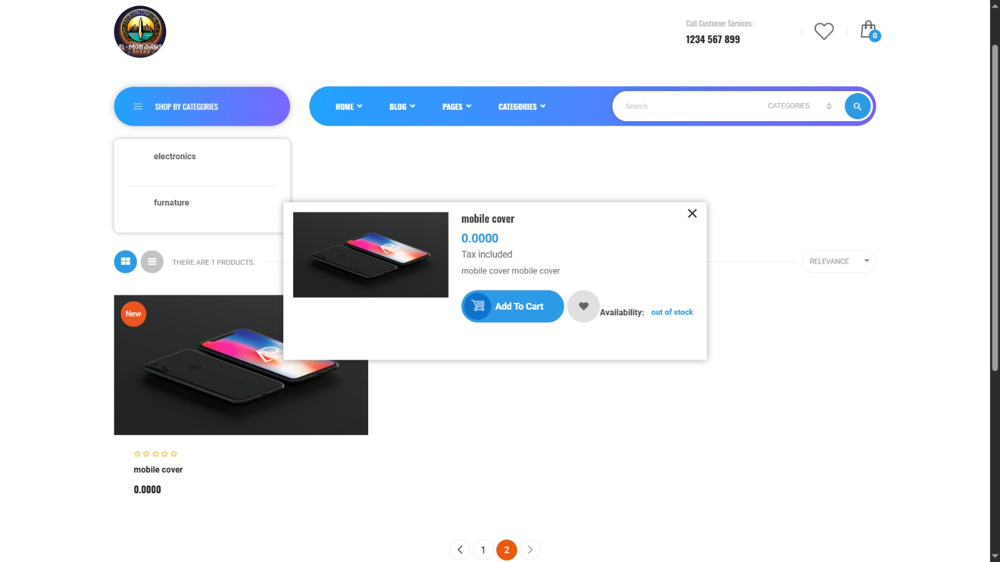
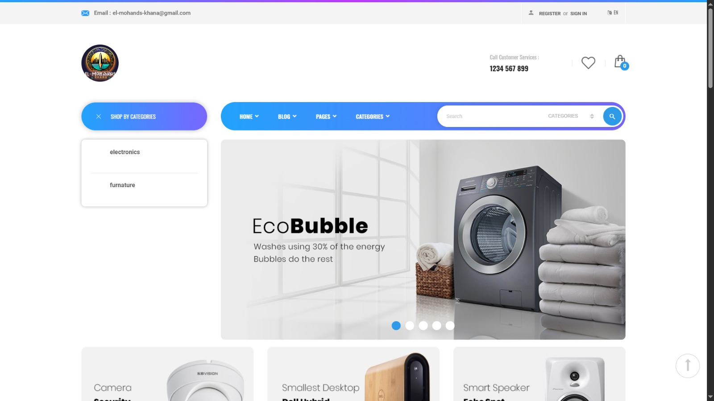
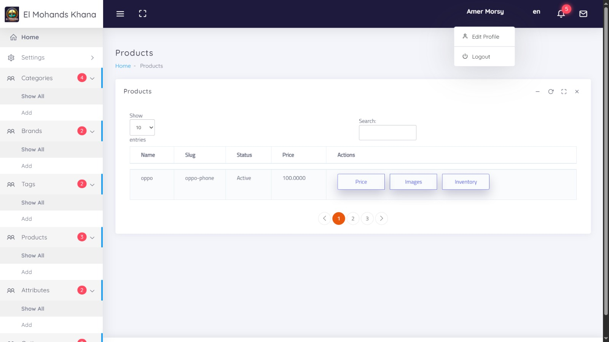
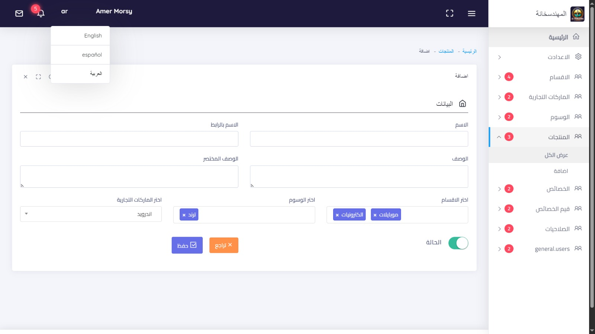

# E-commerce Stores

Welcome to the E-commerce Stores project! This is a comprehensive e-commerce platform built with Laravel, designed to provide a seamless shopping experience for users and robust management tools for store owners.

## Features

-   **User-Friendly Interface**: Intuitive and responsive design for an optimal shopping experience.
-   **Product Management**: Easily add, update, and manage products with detailed descriptions and images.
-   **Shopping Cart**: Efficient shopping cart system with real-time updates and easy checkout process.
-   **Order Management**: Track and manage orders with detailed order history and status updates.
-   **User Authentication**: Secure user authentication and authorization system.
-   **Payment Integration**: Seamless integration with popular payment gateways.
-   **Multi-Language Support**: Supports multiple languages for a global user base.
-   **Real-Time Notifications**: Stay updated with real-time notifications for orders and user activities.
-   **Admin Dashboard**: Comprehensive admin dashboard for managing products, orders, users, and more.

## Technologies Used

-   **Laravel**: A powerful PHP framework for building modern web applications.
-   **Bootstrap**: A popular CSS framework for responsive design.
-   **MySQL**: A reliable and scalable relational database management system.
-   **jQuery**: A fast, small, and feature-rich JavaScript library.
-   **Apache**: A widely-used web server software.

## Getting Started

To get started with the project, follow these steps:

1. Clone the repository
2. Install dependencies:
   composer install
   npm install
3. Set up environment variables:
   cp .env.example .env
4. Generate application key:
   php artisan key:generate
5. Run database migrations:
   php artisan migrate
6. Start the development server:
   php artisan serve
   npm run dev
